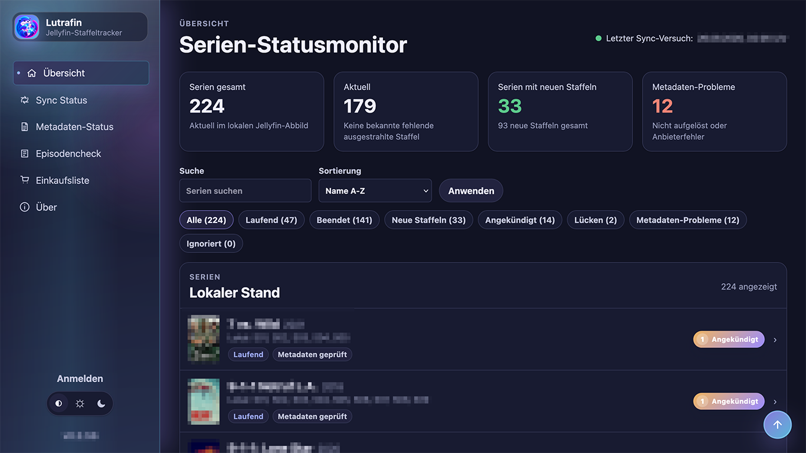

# Lutrafin

### The Jellyfin Companion for People Who Still Buy Their Media

**Know what's missing. Know what's new. Know what to buy next.**

Lutrafin is a self-hosted companion for Jellyfin that keeps track of your TV show collection and tells you when you're missing seasons, when new seasons have aired, and what's coming next.

No downloads. No acquisition automation.  
Just your Jellyfin library, external metadata, and a much better answer to:

**"Wait... do I already own season 4?"**

[Quick Start](#-quick-start) · [What it does](#-what-lutrafin-does) · [Configuration](#️-configuration) · [Security](#-security) · [Development](#-development)

---

<div align="center">



</div>

## 🦦 What is Lutrafin?

Lutrafin compares the TV shows in your **Jellyfin** library with metadata from services such as **TMDB** and **TVmaze**.

It knows which series and seasons you already have locally and can show you:

- 📀 **Missing seasons** — seasons that exist, but aren't in your library
- 🆕 **New seasons** — released seasons you don't have yet
- 📅 **Announced seasons** — what's coming next
- 🔎 **Missing episodes** — gaps inside seasons you already own
- 🛒 **Shopping List** — collect the seasons you want to buy
- 📺 **Streaming availability** — optionally see where a season is currently available
- 🔔 **Notifications** — get notified about newly announced or released seasons

Lutrafin treats Jellyfin as a **read-only source**.

It does **not** download media, trigger library scans, modify Jellyfin metadata, access your media folders or provide integrations with torrent or Usenet services.

Think of it as the missing **collection status dashboard** for Jellyfin.

---

## 🚀 Quick Start

If you already run Docker Compose, getting Lutrafin running is intentionally boring.

### 1. Clone it

```bash
git clone https://github.com/bigshit11elf/lutrafin.git
cd lutrafin
```

### 2. Create your configuration

```bash
cp .env.example .env
mkdir -p secrets
```

Set the Jellyfin address in `.env`:

```env
JELLYFIN_URL=http://192.168.1.100:8096
```

> **Important:** `localhost` usually won't work here.  
> The address must be reachable **from inside the Lutrafin container**.

### 3. Add your secrets

```bash
printf 'your-jellyfin-token' > secrets/jellyfin_token.txt
printf 'your-tmdb-token' > secrets/tmdb_api_token.txt
printf 'choose-a-good-password' > secrets/admin_password.txt
```

### 4. Start it

```bash
docker compose up --build -d
```

Open:

```text
http://YOUR-SERVER:3000
```

**That's it. 🦦**

Once Lutrafin is running, use **Sync Library** to discover your Jellyfin TV libraries and **Refresh All** to populate external metadata.

---

## 💿 Built for people who still own their media

Lutrafin is explicitly **not an acquisition tool**.

It is aimed at people who build their media libraries legally — especially those who buy DVDs, Blu-rays or UHD Blu-rays and encode their own collection where local law permits it.

Lutrafin does not download anything.

It does not talk to torrent clients.

It does not talk to Usenet.

It does not try to "grab" missing seasons.

Instead, it tells you what exists, what you already have, and what you might want to put on your shopping list.

If you run Jellyfin, still believe in actually owning the media you care about, and have reached the point where

> *"I'll remember which seasons I already bought."*

has stopped being a credible database strategy...

**Lutrafin is for you.**

---

## ✨ What Lutrafin does

### Your library at a glance

Lutrafin synchronizes TV shows, seasons and episodes from Jellyfin into its own local SQLite database.

Your Jellyfin installation remains untouched.

The overview compares your collection with external metadata and makes it easy to spot:

| Status | Meaning |
| --- | --- |
| ✅ Up to date | You have the currently released seasons |
| 🆕 New season | A released season is missing locally |
| 📅 Announced | A future season has been announced |
| ⚠️ Incomplete | Individual aired episodes are missing |
| ❓ Unresolved | Lutrafin couldn't confidently match the series |

Lutrafin deliberately prefers **"I don't know"** over matching the wrong show.

### 🛒 Shopping List

Missing and announced seasons can be added to a persistent shopping list.

Use it while browsing your collection, print it, or export it as CSV before hunting for physical releases.

No automated purchasing.

No mystery downloads.

Just a list.

Like civilized people used to have. 😏

### 🔎 Episode Check

Already own a season but something looks suspicious?

The dedicated **Episode Check** compares aired TMDB episodes with your current Jellyfin episode snapshot and finds gaps inside seasons that are already present locally.

Specials are ignored, and completely missing seasons remain in the normal missing-season workflow.

### 📺 Streaming availability

Optionally, Lutrafin can use TMDB watch-provider data for your configured country.

This lets the UI show whether a missing season is currently available through one of your enabled streaming services.

Streaming information is supplemental — your local collection remains the star of the show.

### 🔔 Notifications

Lutrafin can notify you when metadata updates reveal newly announced or newly released seasons.

Supported notification targets include:

- ntfy
- Gotify
- Pushover
- generic JSON webhooks

Events are persisted and deduplicated, so the same season announcement isn't repeatedly sent to you.

---

## 🔒 Jellyfin stays read-only

This is an important design constraint.

Lutrafin uses fixed, read-only Jellyfin API operations.

It does **not**:

- modify Jellyfin metadata
- trigger library scans
- mount your Jellyfin database
- mount your media directories
- expose a generic Jellyfin proxy
- send Jellyfin credentials to the browser

For best results, create a dedicated Jellyfin credential with the narrowest practical access to your TV libraries.

---

## 🧠 Metadata

### TMDB

TMDB is the primary metadata provider when a token is configured.

If Jellyfin already contains a TMDB ID, Lutrafin uses it directly instead of trying to guess which show you're looking at.

### TVmaze

TVmaze can be enabled as a fallback provider.

It is particularly useful when Jellyfin contains TVDB or IMDb identifiers but no TMDB ID.

### Matching philosophy

Metadata matching is intentionally conservative.

Lutrafin prefers:

```text
No confident match
```

over:

```text
Congratulations, your copy of The Office (UK) is apparently The Office (US).
```

Existing provider IDs are preferred over text searches, and ambiguous matches remain unresolved.

---

## ⚙️ Configuration

Docker Compose automatically loads `.env` from the project directory.

A minimal useful configuration looks like this:

```env
APP_BASE_URL=http://localhost:3000
APP_PORT=3000
DATABASE_PATH=/data/app.db

JELLYFIN_URL=http://192.168.1.100:8096

TVMAZE_ENABLED=true
TVDB_ENABLED=false

SYNC_INTERVAL=6h
METADATA_REFRESH_INTERVAL=24h

LOG_LEVEL=info
ADMIN_USERNAME=admin
ADMIN_PASSWORD_FILE=/run/secrets/admin_password
```

Secrets belong in files:

```text
secrets/
├── admin_password.txt
├── jellyfin_token.txt
└── tmdb_api_token.txt
```

Do **not** commit them.

### Common settings

| Variable | Default | Purpose |
| --- | --- | --- |
| `APP_PORT` | `3000` | Lutrafin HTTP port |
| `DATABASE_PATH` | `./data/app.db` | SQLite database |
| `JELLYFIN_URL` | — | Jellyfin server reachable from Lutrafin |
| `SYNC_INTERVAL` | `6h` | Automatic Jellyfin synchronization |
| `METADATA_REFRESH_INTERVAL` | `24h` | External metadata refresh |
| `TVMAZE_ENABLED` | `true` | Enable TVmaze fallback |
| `TVDB_ENABLED` | `false` | Optional TVDB support |
| `LOG_LEVEL` | `info` | Structured logging level |

Many day-to-day options can also be changed directly from **Settings**, including language, country, automation intervals, notifications, streaming providers, metadata providers, diagnostics, ignored series and library exclusions.

---

## 🐳 Docker & HomeLab friendliness

Lutrafin is designed to behave like a good citizen in a self-hosted environment.

The provided container:

- runs as a **non-root user**
- only requires `/data` to be writable
- uses a **read-only filesystem**
- drops unnecessary Linux capabilities
- uses `no-new-privileges`
- does not require Jellyfin media mounts
- does not require access to Jellyfin's database
- loads no browser-facing assets from third-party CDNs

That makes it suitable for the usual suspects:

**Docker · Docker Compose · Unraid · TrueNAS SCALE · Portainer · reverse-proxy setups**

For hardened deployments, keep the security settings from the supplied `docker-compose.yml`.

---

## 🔐 Security

Lutrafin is small, but it isn't intended to be disposable demo code.

Authentication and state-changing operations are server-side controlled. Admin sessions use random session identifiers stored in HTTP-only cookies, while only their hashes are persisted server-side.

Mutating operations use explicit POST requests and framework CSRF protection remains enabled.

API tokens stay server-side.

Health endpoints don't expose secrets or stack traces.

Provider failures are handled without destroying cached metadata.

And because this is self-hosted software, you can inspect the whole thing yourself.

Which brings us to...

---

## 🤖 Yes, AI built most of it

I managed this project rather than pretending I personally hand-crafted every line of TypeScript.

I defined the requirements, architecture and UX, tested the application, commissioned security reviews, challenged questionable implementations and sent things back when they weren't good enough.

**AI did most of the actual coding.**

That distinction matters.

I did not want another piece of disposable vibe-coded sludge.

The codebase has gone through repeated review, refactoring, automated testing and adversarial security checks. Authentication, sessions, CSRF handling, redirects, rate limiting and container security have all been revisited after review findings.

Bugs discovered during review have become regression tests.

AI wrote a lot of code.

It didn't get to mark its own homework.

---

## 🏗️ Built like software, not like a demo

Under the hood:

```text
SvelteKit
TypeScript
SQLite
Drizzle ORM
```

The application uses a deliberately separated application/domain/infrastructure structure.

External API responses are validated.

Jellyfin access is constrained.

Database migrations run automatically during startup.

The test suite covers both normal application behavior and regressions discovered during review.

For the curious:

```text
Jellyfin
   │
   │ read-only
   ▼
Lutrafin
   │
   ├── SQLite
   │
   ├── TMDB
   │
   └── TVmaze
   │
   ▼
Collection status
Missing seasons
Episode gaps
Shopping list
Notifications
```

Your media itself never passes through Lutrafin.

---

## 🩺 Health Checks

Two simple endpoints are available for container orchestration and monitoring:

```text
/health/live
/health/ready
```

`/health/live` checks process liveness.

`/health/ready` verifies internal readiness, including SQLite availability.

---

## 💾 Backup

There is only one piece of application state you really need to care about:

**the `/data` volume containing the SQLite database.**

Back that up alongside your deployment configuration and secrets.

Lutrafin does not need a backup of your Jellyfin database or media directories.

---

## ⬆️ Updating

Pull the latest source/image, rebuild and restart:

```bash
docker compose up --build -d
```

Database migrations are applied automatically during startup before requests and scheduled jobs are served.

The currently running Lutrafin version is visible in the sidebar.

---

## 🛠️ Development

Want to poke at it?

Requirements:

- Node.js 22+
- npm

Then:

```bash
npm install
npm run db:migrate
npm run check
npm test
npm run build
npm run dev
```

`npm run db:migrate` is useful for explicit local setup checks, although the application also applies migrations automatically during startup.

To build the self-contained Docker release archive:

```bash
npm run release:zip
```

The resulting archive is written to:

```text
release/lutrafin-<version>-docker.zip
```

and contains the Docker build context, Compose file, `.env` template and secret-file placeholders.

---

## 🧯 Troubleshooting

### No series found

Check your Jellyfin URL and token, then run **Sync Library**.

If Lutrafin runs inside Docker, remember that `localhost` refers to the Lutrafin container itself — not your Jellyfin host.

### Metadata unresolved

The series probably doesn't contain usable external IDs and the provider search was ambiguous.

This is intentional.

Lutrafin would rather leave a series unresolved than silently match the wrong one.

### Missing seasons aren't appearing

Verify your TMDB token or TVmaze configuration and run **Refresh All**.

### No streaming information

Check that:

- TMDB is configured
- streaming information is enabled
- the correct country/region is selected
- at least one streaming provider is enabled

### Provider error

Check the provider token, availability and rate limits.

Previously cached data remains available.

### Reverse proxy / CSRF problems

For normal direct HomeLab access, `ORIGIN`, `HOST_HEADER` and `PROTOCOL_HEADER` are usually unnecessary.

Behind a reverse proxy, either configure `ORIGIN` with the exact browser-facing URL or forward the appropriate host/protocol headers and configure Lutrafin accordingly.

---

## 🌍 Third-party services

Lutrafin integrates with independent third-party projects and services including Jellyfin, TMDB and TVmaze, with architecture support for TVDB.

These projects are not affiliated with Lutrafin and retain their respective terms, trademarks, attribution requirements and API policies.

### TMDB

> This product uses the TMDB API but is not endorsed or certified by TMDB.

### TVmaze

TV metadata is provided in part by [TVmaze](https://www.tvmaze.com/).

See [`THIRD_PARTY_NOTICES.md`](THIRD_PARTY_NOTICES.md) for dependency and attribution information.

---

## 📜 License

Lutrafin is free and open-source software licensed under:

**GNU Affero General Public License Version 3 only (`AGPL-3.0-only`)**

Copyright © 2026 Richard Becker

See [`LICENSE`](LICENSE) for the full license text.

---

### What am I missing?

**That is the whole point.**

Lutrafin — keeping track of the discs you swore you'd remember buying.

